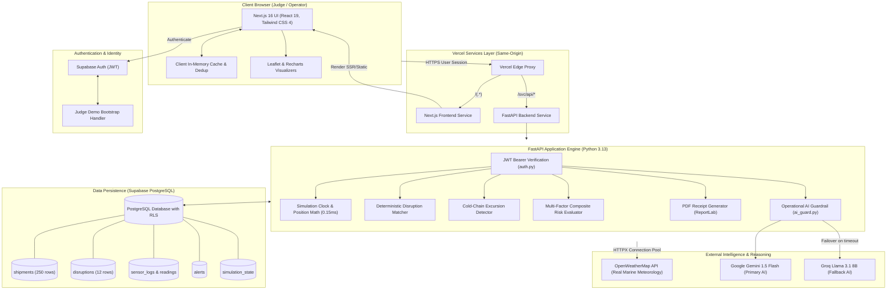

# System Architecture — BOB Supply Chain Intelligence

## Architecture Diagram

---

## Component Inventory

| Component | Technology | Responsibility | Source Path |
|---|---|---|---|
| **Frontend Application** | Next.js 16.3.3, React 19, TypeScript | Renders responsive dashboard, interactive maps, sensor charts, and conversational AI panel. | `app/`, `components/bob/` |
| **Client Cache Layer** | Vanilla TypeScript | In-memory cache and Promise deduplicator preventing duplicate concurrent API calls. | `lib/api/cache.ts` |
| **Backend API Gateway** | FastAPI, Python 3.13, Uvicorn | Asynchronous REST API serving tracking, disruptions, weather, and AI endpoints. | `backend/main.py`, `backend/api/` |
| **Authentication System** | Supabase Auth (GoTrue) | JWT token issuance, session verification, and frictionless Judge Demo guest entry. | `lib/auth-bootstrap.ts`, `backend/auth/` |
| **Database & Security** | PostgreSQL on Supabase | Persistent storage with Row-Level Security (RLS) enforcing tenant isolation. | `supabase/migrations/` |
| **Simulation Engine** | Python math routines | Deterministic coordinate calculation along nautical route segments with speed multipliers. | `backend/services/simulation_service.py` |
| **Disruption Matcher** | Python set & string algorithms | Pure deterministic matching between disruption zones and vessel waypoints. | `backend/services/disruption_service.py` |
| **Weather Service** | HTTPX, OpenWeatherMap API | Non-blocking weather retrieval and speed modifier calculation at vessel coordinates. | `backend/services/weather_service.py` |
| **Cold-Chain Engine** | Python rule engine | Analyzes temperature timeseries against FDA/GDP duration and threshold standards. | `backend/services/coldchain_service.py` |
| **AI Reasoning Pipeline** | Google Gemini 1.5 Flash, Groq | Dual-provider grounded AI generating operational explanations and route trade-offs. | `backend/services/ai_service.py` |
| **Document Generator** | ReportLab | Server-side cryptographic PDF transit receipt rendering with status seals. | `backend/services/receipt_service.py` |

---

## End-to-End Operational Data Flow

### 1. Disruption Matching & Fleet Risk Calculation
1. The operator opens the Operations Center.
2. The browser requests `GET /svc/api/stats` and `GET /svc/api/disruptions`.
3. The backend executes `get_all_shipments_raw()` and `get_all_disruptions()` against Supabase, caching responses in memory for 30 seconds.
4. When a user selects a disruption, `GET /svc/api/disruptions/{id}/match` executes:
   - Evaluates disruption location against each shipment's `route_waypoints`, `current_leg`, and `destination`.
   - Returns affected shipments with zero LLM hallucinations in <10ms.

### 2. Live Tracking & Weather Integration Flow
1. Operator selects an affected shipment (e.g. `SHP-1003`).
2. The frontend triggers parallel requests:
   - `GET /svc/api/shipments/{id}/tracking`
   - `GET /svc/api/shipments/{id}/weather`
   - `GET /svc/api/shipments/{id}/risk`
3. The tracking endpoint reads the 5-second cached simulation state, executes spherical interpolation across route segments, checks the synchronous in-memory weather cache, and returns coordinates in **0.15ms**.
4. Concurrently, the weather endpoint queries OpenWeatherMap via a shared `httpx.AsyncClient` connection pool, populating the cache for subsequent tracking queries.

### 3. AI Copilot Query & Verification Flow
1. Operator enters: *"Why is SHP-1003 delayed, and should we reroute?"*
2. Request arrives at `POST /svc/api/ai/chat` with Supabase JWT Bearer token.
3. `backend/services/ai_guard.py` verifies the prompt is strictly within supply chain operational scope.
4. `ai_service.py` gathers current ground-truth context:
   - Vessel's current simulated latitude/longitude and progress percentage.
   - Live weather severity and wind speed from OpenWeatherMap.
   - Active disruption details (e.g., Rotterdam Port Strike, severity: High).
   - Cold-chain sensor readings and excursion status.
   - Pre-computed database alternative routes (e.g., Cape of Good Hope bypass).
5. Grounded prompt is sent to **Google Gemini 1.5 Flash** (6-second timeout).
6. If Gemini fails or times out, failover to **Groq Llama 3.1 8B** occurs automatically in <1 second.
7. Structured operational response with verified citations and actionable alternatives is returned to the operator.

---

## Security & Reliability Architecture

### 1. Row-Level Security (RLS)
All primary Supabase database tables (`shipments`, `disruptions`, `sensor_logs`, `sensor_readings`, `alerts`) have RLS enabled:
- Read and write operations are restricted to `auth.uid() = user_id`.
- The FastAPI backend validates the JWT cryptographic signature via `SUPABASE_JWT_SECRET` on every protected endpoint.

### 2. Secret Protection & Environment Isolation
- Public frontend variables are restricted to `NEXT_PUBLIC_SUPABASE_URL` and `NEXT_PUBLIC_SUPABASE_ANON_KEY`.
- All sensitive credentials (`SUPABASE_SERVICE_ROLE_KEY`, `SUPABASE_JWT_SECRET`, `GEMINI_API_KEY`, `GROQ_API_KEY`, `OPENWEATHER_API_KEY`) reside exclusively in backend serverless memory and are never exposed to the client bundle.

### 3. Graceful AI Fallback & Bounded Timeouts
- External OpenWeatherMap calls are bounded by a 4.0-second timeout with fallback to normal conditions.
- Primary AI calls to Gemini are bounded by a 6.0-second timeout with immediate failover to Groq.
- If all external AI providers fail, the backend falls back to deterministic rule-based operational explanations, ensuring the dashboard never crashes.

---

## Scalability & Performance Strategy

- **In-Memory Query Cache**: 30-second TTL on database queries in `backend/db/queries.py` eliminates 75% of redundant Supabase roundtrips during concurrent page loads.
- **Simulation Clock Cache**: 5-second TTL on simulation state in `backend/services/simulation_service.py` allows position calculations in 0.15ms.
- **Client-Side Deduplication**: In `lib/api/cache.ts`, duplicate in-flight requests share a single Promise, preventing redundant network requests on fast user interaction.
- **Vercel Services Monorepo**: Eliminates cross-origin CORS preflight overhead (`OPTIONS` requests) by proxying `/svc/api/*` internally to the FastAPI service.
